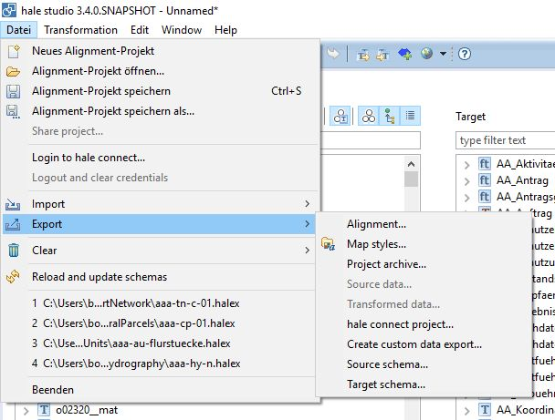
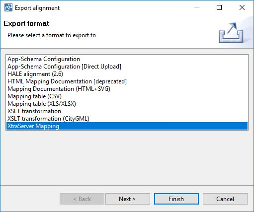
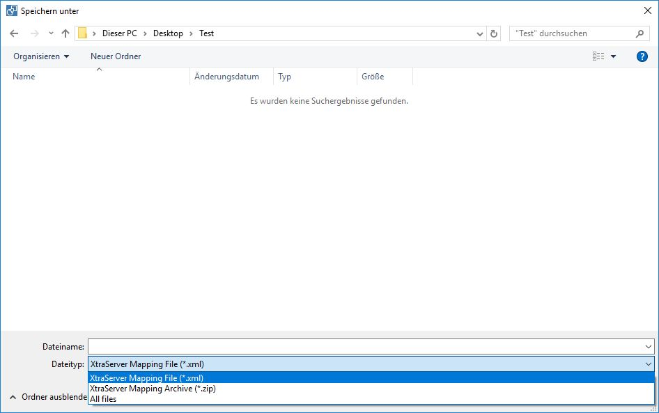

# Export XtraServer mapping

Open the export dialog (File -> Import -> Alignment -> XtraServer Mapping).

Choose the export format XtraServer Mapping in the next step.

There are two different options for the export. You can choose them via the file type field.

- **XtraServer Mapping File (\*.xml)**: only the mapping file is generated.
- **XtraServer Mapping Archive (\*.zip)**: the export will generate a ZIP archive containing all the required files
    - XtraSrvConfig_Mapping.inc.xml
    - XtraSrvConfig_Geoindexes.inc.xml
    - XtraSrvConfig_FeatureTypes.inc.xml
    - XtraSrvConfig_GetSpatialDataSetSQ.inc.xml
    - XtraSrvConfig_StoredQueriesToCache.inc.xml
    