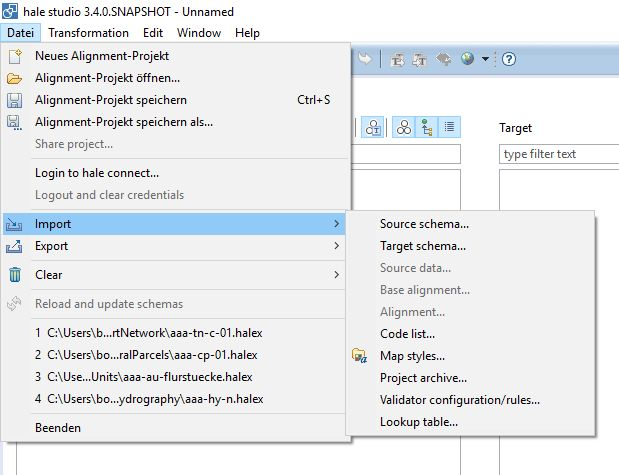
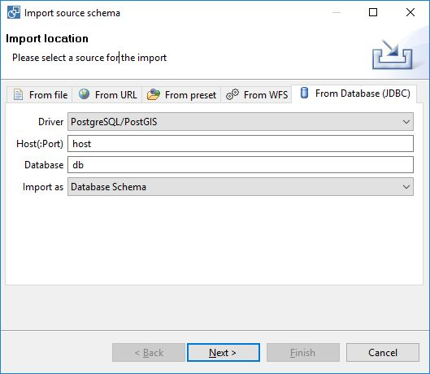
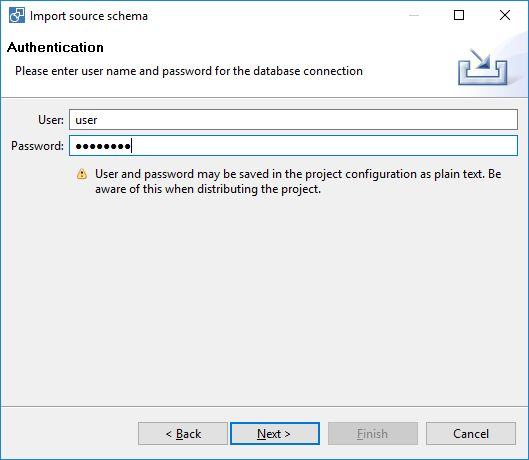
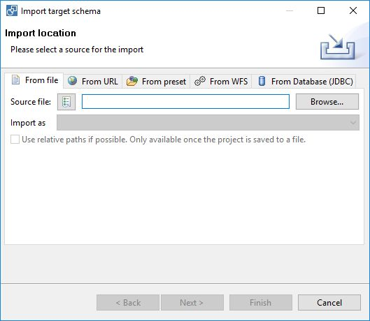
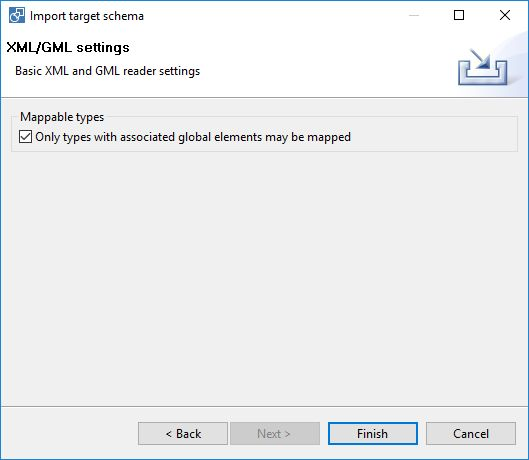
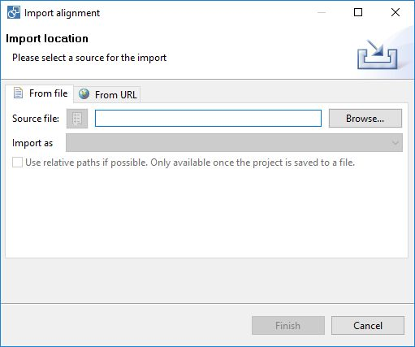

# Import XtraServer mapping

Via the XtraServer plugin it is possible to transform an XtraServer mapping into a hale alignment.

The first step is to import a database schema as source schema. Open the import dialog for source schema (File -> Import -> Source schema).

Select the database panel and configure the database connection

and user settings.

Then import the target schema (File -> Import -> Target schema). 

Notice: activate the checkbox for Mappable types.

In the last step import the alignment from file, e.g. XtraSrvConfig_Mapping.inc.xml (File -> Import -> Alignment). Based on this mapping a hale alignment will be created.

